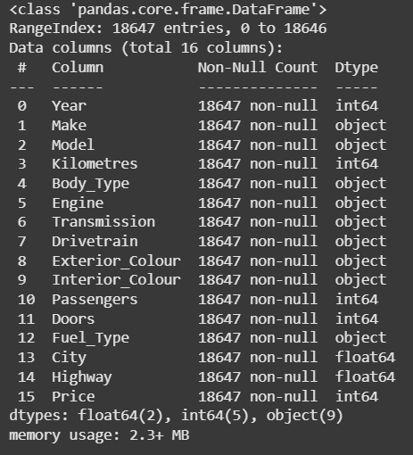
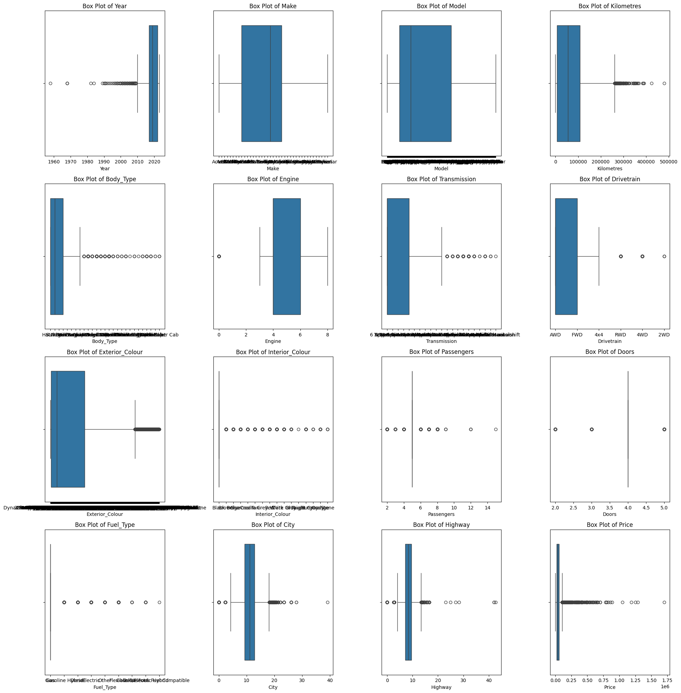
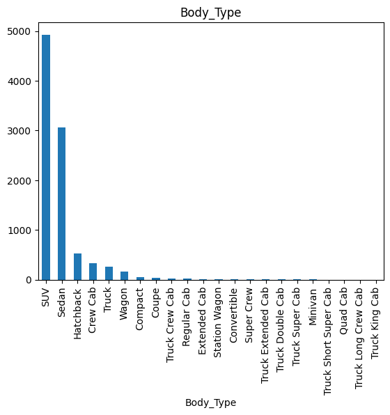
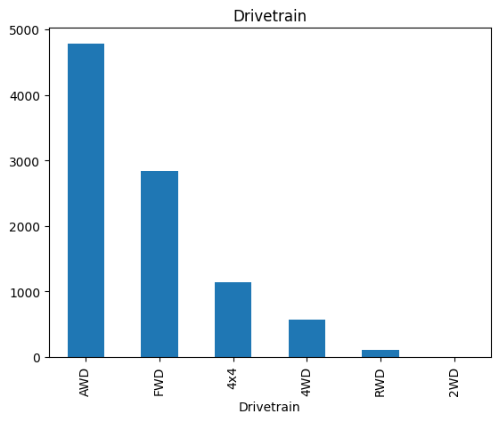
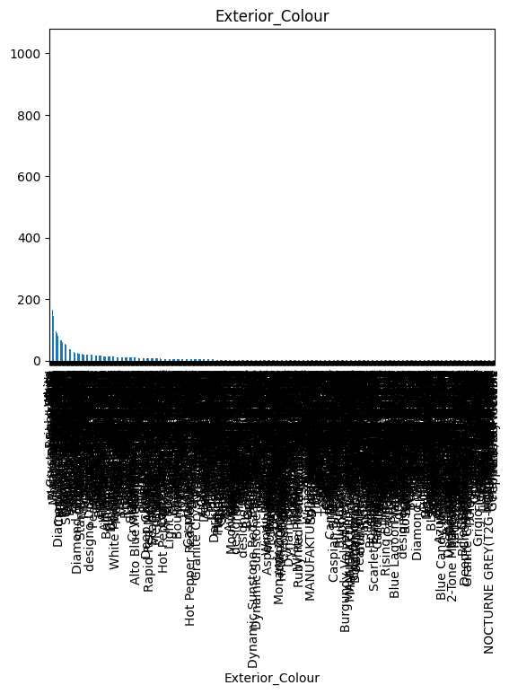
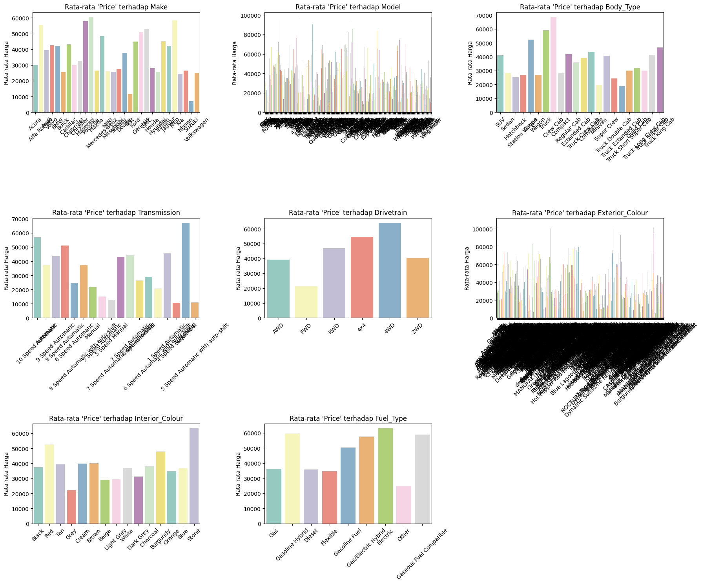
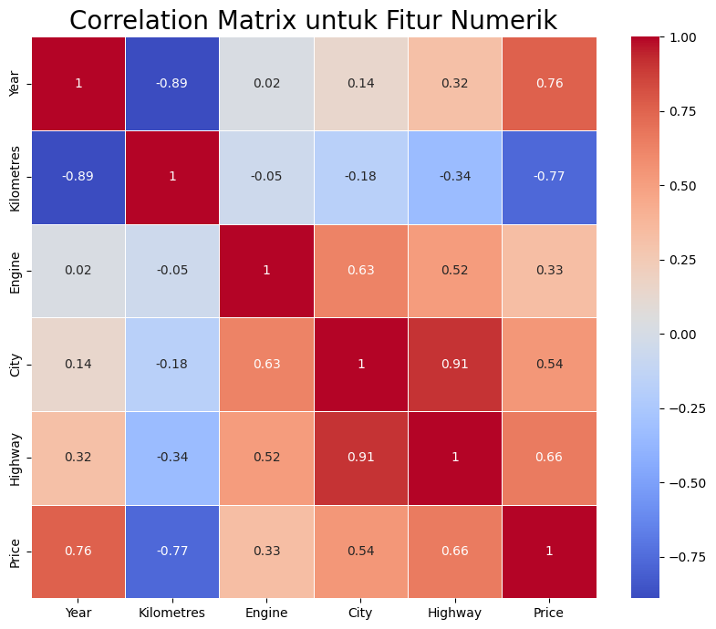
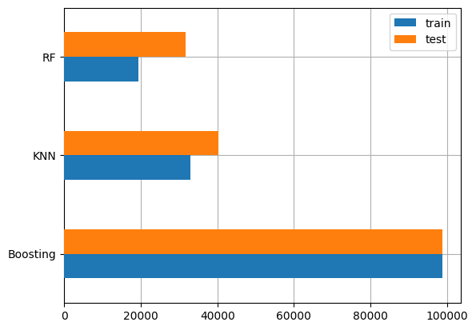
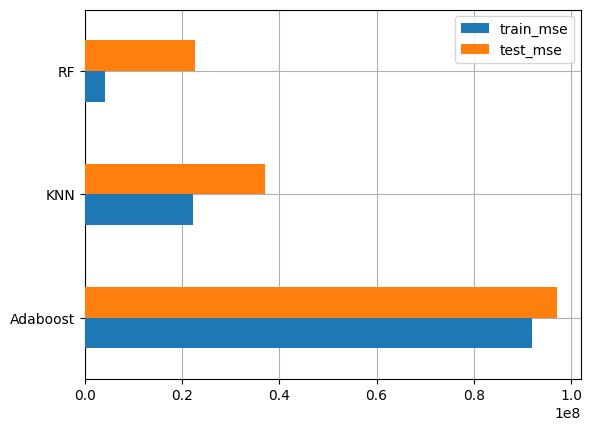

# Laporan Proyek Machine Learning - Febrian Chrisna Ardianto

## Domain Proyek

Industri otomotif, khususnya pasar mobil bekas, telah berkembang pesat dalam beberapa dekade terakhir, seiring dengan meningkatnya kebutuhan masyarakat akan kendaraan yang terjangkau dan berkualitas. Namun, pasar mobil bekas memiliki tantangan tersendiri, terutama dalam hal penentuan harga yang akurat. Penjual sering kali menetapkan harga berdasarkan pengalaman subjektif atau perbandingan sederhana dengan mobil serupa, sementara pembeli mengandalkan negosiasi tanpa memahami nilai sebenarnya dari kendaraan yang mereka beli. Akibatnya, sering terjadi ketidakseimbangan antara harga pasar dengan nilai kendaraan, yang dapat merugikan baik penjual maupun pembeli.

Saat ini industri mobil bekas menghadapi tantangan besar dalam strategi penetapan harga yang dapat mengakibatkan kerugian finansial yang signifikan. Menurut analisis yang dilakukan oleh Indicata UK, dealer mobil bekas di Inggris diproyeksikan mengalami kerugian hampir £500 juta pada tahun 2024 akibat kesalahan dalam menentukan harga kendaraan. Dua kesalahan utama yang teridentifikasi dalam studi ini adalah menetapkan harga terlalu tinggi untuk kendaraan yang lambat terjual dan menjual kendaraan populer terlalu cepat dengan harga pasar tanpa mempertimbangkan premi yang dapat diperoleh.

Untuk mengatasi permasalahan ini, analisis data prediktif berbasis machine learning dapat digunakan untuk mengoptimalkan strategi harga mobil bekas. Model prediktif dapat membantu mengidentifikasi faktor-faktor utama yang mempengaruhi harga kendaraan. Dengan pendekatan ini, penjual dapat menghindari undervaluation pada kendaraan dengan permintaan tinggi dan menyesuaikan harga kendaraan yang kurang diminati secara lebih efektif.
  
Referensi: [Mispricing of used cars could cost UK dealers nearly £500m in 2024](https://www.motorfinanceonline.com/news/indicata-uk-used-car-mispricing/?cf-view) 

## Business Understanding

### Problem Statements

- Bagaimana faktor-faktor seperti tahun pembuatan mobil, jarak tempuh, konsumsi bahan bakar dalam kota (City) dan luar kota (Highway), serta kondisi kendaraan memengaruhi harga mobil bekas?
- Model machine learning apa yang dapat memberikan prediksi terbaik untuk menentukan harga mobil bekas dengan akurasi tinggi?

### Goals

- Menganalisis bagaimana variabel seperti tahun pembuatan mobil, jarak tempuh, konsumsi bahan bakar dalam kota (City) dan luar kota (Highway) memengaruhi harga mobil bekas.
- Mengidentifikasi algoritma machine learning yang dapat memberikan akurasi terbaik untuk memprediksi harga mobil bekas.

### Solution statements
- Menggunakan algoritma dasar seperti K-Nearest Neighbors (KNN) dan Random Forest sebagai model awal untuk memprediksi harga mobil bekas.
- Menggunakan algoritma lanjutan seperti AdaBoost
- Melakukan hyperparameter tuning menggunakan teknik seperti Grid Search untuk menemukan kombinasi parameter yang optimal dan meningkatkan performa model.
- Mengevaluasi model dengan menggunakan metrik seperti MSE untuk mendapatkan gambaran yang lebih baik mengenai seberapa baik model memprediksi harga mobil bekas.


## Data Understanding
Dataset ini berisi informasi mengenai 24.199 kendaraan bekas yang terdaftar untuk dijual pada tahun 2023. Kendaraan-kendaraan tersebut berada dalam radius 25 kilometer dari pusat kota Toronto, Ontario, Kanada, dan datanya diambil dari platform Autotrader.ca. Dengan skor Usability sebesar 10.00, dataset ini telah melalui evaluasi yang ketat dan dinilai  layak untuk mendukung penelitian machine learning. Penilaian ini mencakup aspek kemudahan penggunaan, efisiensi, serta kualitas data yang memenuhi standar tinggi dari kaggle.

Referensi: [Used Vehicles For Sale](https://www.kaggle.com/datasets/farhanhossein/used-vehicles-for-sale?).

### Deskripsi Variable
|    Nama Kolom     |                Deskripsi                       |
|-------------------|------------------------------------------------|
| Year              | Tahun pembuatan mobil (numerik)                |
| Make              | Merek kendaraan (kategorikal)                  |
| Model             | Model kendaraan (kategorikal)                  |
| Kilometres        | Jumlah kilometer yang telah ditempuh (numerik) |
| Body_Type         | Jenis tubuh kendaraan (kategorikal)            |   
| Engine            | Jenis mesin kendaraan (kategorikal)            |
| Transmission      | Jenis transmisi kendaraan (kategorikal)        |
| Drivetrain        | Jenis penggerak kendaraan (kategorikal)        |
| Exterior_Colour   | Warna eksterior kendaraan (kategorikal)        |
| Interior_Colour   | Warna interior kendaraan (kategorikal)         |
| Passengers        | Jumlah penumpang kendaraan (numerik)           |
| Doors             | Jumlah pintu kendaraan (numerik)               |
| Fuel_Type         | Jenis bahan bakar kendaraan (kategorikal)      |
| City              | Konsumsi bahan bakar di kota (numerik)         |
| Highway           | Konsumsi bahan bakar di jalan tol (numerik)    |
| Price             | Harga kendaraan (numerik)                      |

Jumlah Baris (Entries): 18,647 baris data, terdapat 18,647 entri atau record yang tercatat dalam dataset ini.

Jumlah Kolom (Columns): 16 kolom data, yang mencakup berbagai atribut terkait kendaraan yang dicatat dalam dataset.

### Kesalahan Tipe Data



Terdapat kesalahan tipe data pada kolom Engine, yang seharusnya berisi angka. Hal ini dapat menyebabkan masalah saat analisis atau pemodelan data. Masalah ini akan ditangani pada tahap data preparation, di mana tipe data pada kolom Engine akan diperbaiki agar sesuai dengan format yang diinginkan

### Missing Value


Pada dataset ini, terdapat beberapa kolom yang memiliki nilai yang hilang. Kolom Kilometres memiliki 470 nilai yang hilang, sementara kolom Engine memiliki 331 nilai yang hilang. Kolom City dan Highway masing-masing memiliki 255 nilai yang hilang. Sementara itu, kolom lainnya seperti Year, Make, dan Model tidak memiliki nilai yang hilang.

### Data Duplikat


Terdapat duplikasi data pada dataset ini, di mana beberapa entri kendaraan memiliki informasi yang sama persis, termasuk Year, Make, Model, Kilometres, Engine, Transmission, Drivetrain, Exterior_Colour, Interior_Colour, Passengers, Doors, Fuel_Type, City, Highway, dan Price. Duplikasi ini terjadi pada beberapa baris berturut-turut dengan ID yang berbeda, yang kemungkinan disebabkan oleh kesalahan dalam pengumpulan atau pengolahan data. Data duplikat ini perlu dihapus atau ditangani pada tahap data preparation untuk mencegah pengaruh negatif pada analisis atau pemodelan.

### Outlier



Pada boxplot ini, terlihat banyak outlier pada beberapa kolom, seperti Kilometres, Engine, City, Highway, dan Price. Nilai-nilai ekstrem ini berada jauh di luar rentang normal dan dapat mempengaruhi hasil analisis. Outlier tersebut perlu ditangani pada tahap data preparation agar tidak mengganggu pemodelan atau analisis selanjutnya.

## Exploratory Data Analysis

### Univariate Analysis
#### Categorical Features
Make:


Insight:
- Hyundai, Kia, Ford, dan Nissan merupakan merek yang paling banyak terwakili dalam dataset, menunjukkan popularitas dan potensi pasar yang kuat.
- Suzuki paling sedikit, mengindikasikan kurang populer.
- Meskipun terdapat ketidakseimbangan jumlah sampel antar merek, hal ini mencerminkan kondisi pasar mobil bekas yang sebenarnya dan dapat diatasi dengan teknik pemrosesan data yang sesuai.
- Keberagaman merek yang ada memungkinkan eksplorasi faktor-faktor yang mempengaruhi harga mobil bekas dari berbagai perspektif.
  
Model:


Insight:
- Distribusi jumlah sampel per model memiliki pola sangat asimetris, dengan beberapa model menunjukkan volume yang sangat besar dibandingkan model lain.
- Civic memiliki jumlah sampel tertinggi, jauh melebihi model lain. Ini mengindikasikan bahwa Civic adalah model yang paling banyak dijual atau paling banyak terdapat dalam dataset.
- Sebagian besar model lainnya memiliki jumlah sampel yang relatif kecil, mengindikasikan model-model tersebut tidak terlalu banyak dijual atau terdapat dalam dataset.

Body_Type:



Insight:
- SUV merupakan jenis bodi yang paling umum, dengan lebih dari 5.000 sampel. Hal ini menunjukkan bahwa SUV adalah jenis kendaraan bekas yang paling banyak terdapat dalam dataset.
- Beberapa jenis bodi memiliki jumlah sampel yang relatif rendah, seperti Truck Long Crew Cab, Truck Short Crew Cab, dan Truck Long Crew Cab. Ini mengindikasikan bahwa jenis-jenis bodi tersebut kurang umum di pasar kendaraan bekas yang tercakup dalam dataset ini.
- Distribusi jenis bodi tidak merata, dengan beberapa jenis bodi mendominasi dataset, sementara banyak lainnya memiliki representasi yang jauh lebih sedikit.

Transmission:


Insight:
- Automatic transmisi memiliki jumlah sampel yang jauh lebih besar dibandingkan jenis transmisi lainnya, menunjukkan bahwa transmisi otomatis sangat dominan dalam dataset kendaraan bekas ini.
- Manual transmisi memiliki jumlah sampel yang jauh lebih rendah dibandingkan automatic, mengindikasikan bahwa manual transmisi kurang populer di pasar kendaraan bekas yang tercakup dalam dataset.
- Terdapat beberapa varian automatic transmisi, seperti 5-Speed Automatic, 6-Speed Automatic, dan 10-Speed Automatic, masing-masing memiliki representasi yang cukup signifikan. Ini menunjukkan adanya diversifikasi jenis transmisi otomatis yang digunakan dalam kendaraan bekas.
- Untuk jenis manual transmisi, 5-Speed Manual dan 6-Speed Manual memiliki jumlah sampel yang paling besar, sementara varian lain seperti 8-Speed Manual dan 1-Speed Auto-Shift Manual memiliki representasi yang sangat terbatas.

Drivetrain:



Insight:
- AWD (All-Wheel Drive) memiliki jumlah sampel yang jauh lebih besar dibandingkan jenis drivetrain lainnya, menunjukkan bahwa model kendaraan dengan penggerak roda empat (AWD) sangat dominan dalam dataset ini.
- FWD (Front-Wheel Drive) memiliki jumlah sampel yang cukup besar, meskipun jauh di bawah AWD. Hal ini mengindikasikan bahwa kendaraan dengan penggerak roda depan juga merupakan kategori yang umum dalam dataset.
- 4x4 (Four-Wheel Drive) memiliki jumlah sampel yang lebih rendah dibandingkan AWD dan FWD, namun masih cukup signifikan. Ini menunjukkan bahwa kendaraan dengan penggerak roda empat juga merupakan pilihan yang populer dalam pasar kendaraan bekas.
- RWD (Rear-Wheel Drive) dan 2WD (2-Wheel Drive) memiliki jumlah sampel yang jauh lebih sedikit dibandingkan tiga jenis drivetrain sebelumnya. Hal ini mengindikasikan bahwa model kendaraan dengan penggerak roda belakang atau dua roda tidak terlalu umum dalam dataset ini.

Exterior_Colour:



Insight:
- Distribusi jenis warna eksterior kendaraan dalam dataset ini sangat beragam, dengan banyak kategori yang berbeda-beda.
- Warna eksterior yang paling dominan adalah Black, dengan jumlah sampel yang jauh lebih tinggi dibandingkan kategori warna lainnya. Ini menunjukkan bahwa kendaraan dengan warna gelap atau hitam merupakan pilihan populer dalam pasar kendaraan bekas.
- Selain Black, terdapat beberapa warna lain yang juga memiliki representasi cukup signifikan, seperti White, Gra. Ini mengindikasikan bahwa warna-warna netral atau solid juga diminati oleh konsumen kendaraan bekas.
- Sementara itu, terdapat banyak kategori warna dengan jumlah sampel yang sangat rendah, seperti Bronze, Turquoise, dan Lime Green. Hal ini mungkin menunjukkan bahwa warna-warna yang lebih jarang atau eksotis tidak sepopuler warna-warna standar.

Interior_Colour:


Insight:
- Berdasarkan grafik, warna interior yang paling dominan adalah Black dengan jumlah sampel yang jauh melebihi kategori warna interior lainnya. Ini menunjukkan bahwa kendaraan dengan interior berwarna gelap atau hitam sangat populer di pasar kendaraan bekas.
- Setelah Black, terdapat beberapa warna interior lain yang juga memiliki representasi yang cukup signifikan, seperti Gray, Tan, dan Brown. Hal ini mengindikasikan bahwa konsumen juga menyukai pilihan warna interior yang lebih netral atau alami.
- Sementara itu, beberapa kategori warna interior seperti Blue, Burgundy, dan Ivory memiliki jumlah sampel yang relatif rendah. Ini mungkin menandakan bahwa pilihan warna interior yang lebih berani atau unik kurang diminati dalam pasar kendaraan bekas.
- Secara keseluruhan, visualisasi fitur Interior_Colour menunjukkan preferensi konsumen yang jelas terhadap warna interior gelap atau netral.

Fuel_Type:


Insight:
- Dari grafik, dapat dilihat bahwa jenis bahan bakar yang paling dominan adalah Gas. Jumlah sampel untuk Gas sangat tinggi, jauh melebihi kategori bahan bakar lainnya.
- Setelah Gas, terdapat beberapa kategori bahan bakar lain yang juga memiliki representasi yang cukup signifikan, seperti Gasoline-Hybrid, Diesel, dan Flex-Fuel. Ini menunjukkan bahwa selain gas, ada pula preferensi konsumen terhadap opsi bahan bakar lainnya.
- Sementara itu, kategori bahan bakar seperti Electric, Other, dan Gasoline/Electric Hybrid memiliki jumlah sampel yang relatif rendah. Hal ini bisa berarti bahwa kendaraan berbahan bakar elektrik atau hibrida belum terlalu populer dalam dataset kendaraan bekas ini.
- Secara keseluruhan, visualisasi fitur Fuel_Type mengungkapkan bahwa kendaraan berbahan bakar gas adalah pilihan dominan di pasar kendaraan bekas

### Numerical Features


Insight:
- Tahun Pembuatan (Year):
Distribusi tahun pembuatan menunjukkan pola yang menarik, dengan peningkatan signifikan pada tahun 2016 hingga mencapai puncak pada tahun 2018 dan 2022. Hal ini menunjukkan bahwa dataset ini lebih fokus pada kendaraan bekas yang relatif baru, dengan data yang lebih banyak di tahun-tahun terkini hingga 2022. Pola ini memberikan wawasan tentang tren pasar kendaraan bekas yang semakin mengarah pada model-model terbaru.

- Kilometer (Kilometres):
Distribusi kilometer menunjukkan tren umum dalam pasar kendaraan bekas, dengan jumlah kendaraan terbanyak berada pada rentang kilometer yang lebih rendah. Hal ini mencerminkan preferensi konsumen terhadap kendaraan bekas dengan kondisi yang masih baik dan jarak tempuh yang tidak terlalu tinggi. Data ini dapat memberikan gambaran tentang segmen pasar kendaraan bekas yang lebih diminati, serta faktor-faktor yang mempengaruhi harga.

- Jumlah Mesin (Engine):
Sebagian besar kendaraan dalam dataset ini dilengkapi dengan mesin berkapasitas 4 atau 5 silinder. Ini menunjukkan bahwa mesin dengan kapasitas tersebut cenderung lebih umum dan diminati oleh konsumen karena memberikan keseimbangan antara performa dan efisiensi bahan bakar. Analisis lebih lanjut mengenai hubungan kapasitas mesin, efisiensi bahan bakar, dan harga kendaraan dapat memberikan wawasan berharga dalam memahami preferensi pasar.

- Jumlah Penumpang (Passengers) dan Pintu (Doors):
Sebagian besar kendaraan dalam dataset ini memiliki kapasitas 4 hingga 5 penumpang dan 4 hingga 5 pintu. Hal ini mengindikasikan bahwa kendaraan yang lebih banyak digunakan untuk keluarga atau tujuan multi-guna lebih dominan di pasar kendaraan bekas. Memahami hubungan antara jumlah penumpang, pintu, dan atribut lainnya dapat memberikan wawasan lebih lanjut mengenai preferensi konsumen dan pengaruhnya terhadap harga.

- Konsumsi Bahan Bakar (City, Highway):
Distribusi konsumsi bahan bakar menunjukkan bahwa sebagian besar kendaraan dalam dataset memiliki efisiensi bahan bakar yang cukup baik, dengan angka konsumsi yang lebih rendah, baik di kota maupun di jalan tol. Hal ini mencerminkan tren konsumen yang lebih memilih kendaraan hemat bahan bakar, terutama mengingat harga bahan bakar yang terus meningkat. Analisis lebih lanjut dapat mengidentifikasi hubungan antara efisiensi bahan bakar, harga kendaraan, dan faktor-faktor lainnya yang memengaruhi pasar.

- Harga (Price):
Distribusi harga kendaraan bekas menunjukkan variasi yang cukup besar, dari harga yang relatif rendah hingga menengah. Hal ini mencerminkan keragaman dalam kondisi, model, dan fitur kendaraan dalam dataset. Analisis hubungan antara harga dan fitur-fitur lainnya dapat membantu dalam merancang model prediksi harga yang lebih akurat, dengan mempertimbangkan berbagai faktor yang memengaruhi harga kendaraan bekas.


## Multivariate Analysis
### Categorical Features


Insight:
- Merek vs Harga: Grafik pertama menunjukkan variasi yang signifikan pada harga rata-rata kendaraan bekas di antara berbagai merek, dengan beberapa merek seperti Toyota dan Honda memiliki harga yang jauh lebih tinggi dibandingkan merek lain seperti Mitsubishi dan Geo. Hal ini mengindikasikan bahwa merek kendaraan merupakan faktor penting yang menentukan harga kendaraan bekas.
- Model vs Harga: Grafik kedua semakin memperkuat bahwa model kendaraan juga merupakan faktor kritis, dengan variabilitas harga rata-rata yang bahkan lebih besar di antara model-model yang berbeda dalam satu merek yang sama. Beberapa model tampaknya mampu mempertahankan nilai jualnya jauh lebih baik dibandingkan model lain.
- Jenis Bodi vs Harga: Grafik ketiga menunjukkan bahwa jenis bodi kendaraan juga merupakan variabel kunci, dengan SUV, truk, dan beberapa sedan mewah cenderung berada pada kisaran harga yang lebih tinggi, sementara sedan dan hatchback dasar umumnya memiliki harga yang lebih rendah.
- Transmisi vs Harga: Grafik keempat memperlihatkan bahwa jenis transmisi juga berperan, dengan transmisi otomatis memiliki harga rata-rata yang lebih tinggi dibandingkan manual.
- Drivetrain vs Harga: Grafik kelima mengindikasikan bahwa konfigurasi Drivetrain all-wheel drive dan four-wheel drive terkait dengan harga kendaraan bekas yang lebih tinggi dibandingkan penggerak roda depan atau belakang.
- Warna Eksterior vs Harga: Grafik keenam mengungkapkan bahwa warna eksterior juga dapat memengaruhi harga, dengan warna netral seperti putih, hitam, dan abu-abu cenderung memiliki harga rata-rata yang lebih tinggi dibandingkan warna yang lebih berani atau tidak biasa.
- Warna Interior vs Harga: Serupa dengan itu, grafik ketujuh menunjukkan bahwa warna interior juga berpengaruh terhadap harga kendaraan bekas, dengan interior berwarna hitam menjadi yang paling bernilai secara rata-rata.
- Jenis Bahan Bakar vs Harga: Grafik kedelapan memperlihatkan bahwa kendaraan berbahan bakar bensin umumnya memiliki harga kendaraan bekas yang paling tinggi, sementara tipe bahan bakar alternatif seperti listrik dan hibrida cenderung memiliki harga yang lebih rendah.


### Correlation Matrix
### Numerical Features
Heatmap digunakan untuk menggambarkan matriks korelasi antar fitur dalam dataset, yang menunjukkan sejauh mana hubungan linear antar fitur. Nilai korelasi ini membantu dalam proses seleksi fitur dengan mengidentifikasi fitur-fitur yang saling berkorelasi kuat. Untuk mengukur hubungan antara fitur numerik dan fitur target, metode Spearman dapat digunakan, karena mampu mengukur korelasi monotonik, yaitu hubungan yang tidak selalu linear, namun tetap menunjukkan kecenderungan pergerakan bersama antara dua variabel. Dimana berguna ketika data tidak mengikuti hubungan linear yang sempurna


Insight:
- Tahun (Year) vs Lainnya
  
  Tahun menunjukkan korelasi negatif yang kuat dengan Kilometer (-0,89) dan Harga (-0,77). Ini berarti semakin tua kendaraan, semakin rendah jarak tempuh dan harga jual kendaraan bekas.

- Kilometer (Kilometres) vs Lainnya
  
  Kilometer memiliki korelasi negatif dengan Tahun (-0,89) dan Harga (-0,34). Dengan kata lain, kendaraan dengan jarak tempuh lebih tinggi cenderung lebih tua dan memiliki harga yang lebih rendah.

- Mesin (Engine) vs Lainnya
  
  Kapasitas mesin menunjukkan korelasi positif sedang dengan konsumsi bahan bakar di Kota (0,52) dan Jalan Tol (0,63). Artinya, mesin berkapasitas lebih besar biasanya dihubungkan dengan konsumsi bahan bakar yang lebih tinggi.

- Kota (City) vs Lainnya
  
  Konsumsi bahan bakar di Kota memiliki korelasi positif sedang dengan Mesin (0,52) dan sangat kuat dengan Jalan Tol (0,91). Ini menunjukkan hubungan erat antara konsumsi bahan bakar di kota dan jalan tol, serta pengaruh kapasitas mesin terhadap keduanya.

- Jalan Tol (Highway) vs Lainnya
  
  Jalan Tol memiliki korelasi sangat kuat dengan Kota (0,91) dan sedang dengan Mesin (0,63). Hal ini menguatkan bahwa konsumsi bahan bakar di kota dan jalan tol saling terkait erat, dan kapasitas mesin turut berkontribusi pada pola konsumsi tersebut.

## Data Preparation

### Menangani Kesalahan Tipe Data

Pada kolom Engine, terdapat kesalahan tipe data dimana nilai string 'E' muncul, padahal seharusnya nilai tersebut adalah 0, yang menunjukkan bahwa mobil tersebut tidak memiliki mesin berbahan bakar fosil atau merupakan mobil listrik. Untuk memperbaiki hal ini, nilai 'E' telah diganti dengan 0, dan tipe data kolom tersebut telah diubah menjadi integer agar lebih sesuai dengan format yang diinginkan dan dapat digunakan dalam analisis lebih lanjut.

```python
cars['Engine'] = cars['Engine'].replace('E', 0)
cars['Engine'] = cars['Engine'].astype(int)
print(cars['Engine'].unique())
```

### Menangani Missing Value

Beberapa kolom seperti Kilometres, Engine, City, dan Highway memiliki nilai 0, yang sebenarnya wajar. Nilai 0 pada Kilometres bisa menunjukkan mobil baru yang belum terpakai. Pada Engine, 0 mungkin merujuk pada kendaraan listrik atau yang tidak memiliki mesin berbahan bakar fosil. Sementara pada City dan Highway, nilai 0 bisa terjadi jika konsumsi bahan bakar belum diuji atau kendaraan baru yang efisien. Nilai 0 ini tidak mempengaruhi validitas data.

### Menangani Data Duplikat

Dataset ini awalnya memiliki beberapa baris duplikat, yang dapat terjadi karena kesalahan pencatatan atau data yang dimasukkan lebih dari sekali. Namun, untuk memastikan kualitas dan akurasi data, baris-baris duplikat tersebut telah diidentifikasi dan dihapus, sehingga dataset ini kini hanya berisi entri yang unik dan valid.

```python
duplicate_rows = cars[cars.duplicated()]

if not duplicate_rows.empty:
    print("Duplicate Rows:")
    print(duplicate_rows)
else:
    print("No duplicate rows found.")

cars = cars.drop_duplicates()
```


### Menangani Outlier

Dataset ini mengandung outliers yang terdeteksi pada beberapa kolom tertentu. Dalam proyek ini, digunakan metode IQR untuk mendeteksi dan menangani outlier pada dataset.

Mengapa menggunakan IQR?
- IQR adalah metode statistik yang sederhana dan tidak bergantung pada asumsi distribusi data.
- Metode ini menghitung rentang antar kuartil (Q3 - Q1), di mana Q1 adalah kuartil pertama (25%) dan Q3 adalah kuartil ketiga (75%).
- Nilai-nilai yang berada di luar rentang [Q1 - 1.5IQR, Q3 + 1.5IQR] dianggap sebagai outlier.
- Cocok untuk data dengan distribusi tidak normal dan lebih tahan terhadap pengaruh outlier ekstrem dibandingkan metode lain.


```python
cars_numerik = cars.select_dtypes(include=['number'])```

Q1 = cars_numerik.quantile(0.25) ```
Q3 = cars_numerik.quantile(0.75)
IQR=Q3-Q1
cars=cars[~((cars_numerik<(Q1-1.5*IQR))|(cars_numerik>(Q3+1.5*IQR))).any(axis=1)]

# Cek ukuran dataset setelah kita drop outliers
cars.shape
```

### Drop Fitur Doors dan Passengers


Berdasarkan deskripsi statistik dari kedua fitur ini, yaitu Doors dan Passengers, dapat dilihat bahwa keduanya memiliki nilai yang sama secara konsisten untuk semua baris data yaitu Doors selalu bernilai 4, dan Passengers selalu bernilai 5.

```python
cars = cars.drop(['Doors', 'Passengers'], axis=1)
```

Hal ini menunjukkan bahwa kedua fitur ini tidak mengandung variasi atau informasi yang berguna karena nilainya statis di seluruh dataset. Ketika diperiksa lebih lanjut dalam correlation matrix, keduanya tidak memiliki hubungan yang berarti dengan fitur lainnya, bahkan tidak ada nilai numerik yang muncul. Oleh karena itu, kedua fitur ini harus di-drop, karena mereka tidak memberikan kontribusi apa pun terhadap model dan hanya akan menambah kompleksitas data tanpa menambah informasi yang berguna

Setelah dipastikan bahwa data bersih dan siap digunakan oleh model machine learning. Langkah selanjutnya dalam Data preparation meliputi langkah-langkah berikut:
1. Encoding Fitur Kategori: Fitur kategori seperti Make, Model, Body_Type, dll., diubah menjadi format numerik menggunakan One-Hot Encoding. Tujuan dari encoding ini adalah agar model machine learning dapat memproses data kategorikal dengan lebih baik karena sebagian besar model hanya bisa bekerja dengan data numerik
2. Train Test Split: Dataset dibagi menjadi 80% data pelatihan (X_train, y_train) dan 20% data pengujian (X_test, y_test). Fitur (X) adalah semua kolom kecuali Price, sementara target (y) adalah kolom Price
3. Standarisasi: Fitur numerik seperti Year, Kilometres, Efficiency, dan Engine distandarisasi menggunakan StandardScaler. Tujuan standarisasi adalah untuk membawa semua fitur ke skala yang sama, sehingga model tidak akan condong ke fitur dengan nilai lebih besar, menghindari bias dalam pemodelan
4. Reduksi dimensi fitur dengan PCA: Fitur City dan Highway digabungkan menjadi satu fitur baru Efficiency menggunakan PCA karena kedua fitur tersebut memiliki korelasi yang tinggi. Tujuan dari PCA adalah untuk mengurangi dimensi fitur, mengurangi kompleksitas data, dan menangkap informasi penting dalam satu komponen, sehingga model menjadi lebih efisien

## Modeling
Tahapan ini membahas mengenai model machine learning yang digunakan untuk menyelesaikan permasalahan. Algoritma yang digunakan yaitu:
1. **K-Nearest Neighbor**

    K-Nearest Neighbor (KNN) adalah algoritma supervised learning yang digunakan untuk regresi dan klasifikasi. Prinsip dasar dari KNN adalah bahwa prediksi untuk suatu data baru dilakukan berdasarkan mayoritas nilai atau rata-rata dari k tetangga terdekatnya di ruang fitur. KNN tidak memerlukan model eksplisit dan memanfaatkan jarak antar data untuk membuat keputusan. Dalam regresi, nilai prediksi dihitung sebagai rata-rata nilai target dari k tetangga terdekat.

    **Parameter:**
    - `n_neighbors=13:` Menentukan jumlah tetangga terdekat yang akan digunakan untuk menghitung prediksi. Semakin besar nilai k, semakin smooth modelnya, tetapi terlalu besar bisa mengurangi akurasi jika data tidak linier.
      
  ```python
    from sklearn.neighbors import KNeighborsRegressor
    from sklearn.metrics import mean_squared_error
    
    knn = KNeighborsRegressor(n_neighbors=13)
    knn.fit(X_train, y_train)
    
    models.loc['train_mse','knn'] = mean_squared_error(y_pred = knn.predict(X_train), y_true=y_train)
  ```
2. Random Forest

    Random Forest adalah algoritma ensemble learning yang menggabungkan beberapa pohon keputusan (decision trees). Setiap pohon keputusan dibuat dengan subset acak dari data dan fitur, dan hasilnya digabungkan untuk memberikan prediksi akhir. Random Forest mengurangi overfitting yang sering terjadi pada pohon keputusan tunggal dengan cara menggabungkan banyak model.

    Parameter:
    - `n_estimators=100:` Menentukan jumlah pohon keputusan dalam hutan. Semakin banyak pohon, semakin kuat modelnya, meskipun dengan biaya komputasi yang lebih tinggi.
    - `max_depth=10:` Menentukan kedalaman maksimum setiap pohon keputusan. Membatasi kedalaman pohon dapat membantu menghindari overfitting.
    - `random_state=55:` Mengatur seed untuk menghasilkan hasil yang dapat diulang.
    - `n_jobs=-1:` Menggunakan semua core prosesor untuk mempercepat komputasi.
   
  ```python
    from sklearn.ensemble import RandomForestRegressor
    
    # buat model prediksi
    RF = RandomForestRegressor(n_estimators=100, max_depth=10, random_state=55, n_jobs=-1)
    RF.fit(X_train, y_train)
    
    models.loc['train_mse','RandomForest'] = mean_squared_error(y_pred=RF.predict(X_train), y_true=y_train)
   ```
2. Adaptive Boosting

    AdaBoost (Adaptive Boosting) adalah algoritma ensemble yang membangun model prediktif secara iteratif. Pada setiap iterasi, model yang lebih lemah diberikan bobot lebih besar untuk memperbaiki kesalahan yang dibuat oleh model sebelumnya. AdaBoost bekerja dengan meningkatkan model-model yang lemah menjadi model yang lebih kuat dengan memberikan perhatian lebih pada data yang sulit diprediksi

    Parameter:
    - `n_estimators=250:` Menentukan jumlah iterasi (jumlah model yang akan digabungkan). Semakin besar jumlah estimators, semakin kuat modelnya.
    - `learning_rate=0.01`: Mengontrol seberapa besar pengaruh setiap model baru pada keseluruhan model yang dihasilkan. Dengan nilai yang kecil seperti 0.01, model akan belajar lebih perlahan, memberikan kontribusi lebih kecil pada setiap iterasi
    - `random_state=50:` Mengatur seed untuk menghasilkan hasil yang dapat diulang.
      
  ```python
    from sklearn.ensemble import AdaBoostRegressor
    
    boosting = AdaBoostRegressor(n_estimators=250,
                                 learning_rate=0.01,
                                 random_state=50)
    
    boosting.fit(X_train, y_train)
    models.loc['train_mse','Boosting'] = mean_squared_error(y_pred=boosting.predict(X_train), y_true=y_train)
  ```

## Evaluation
### Metrik Evaluasi

Mean Squared Error (MSE) digunakan sebagai metrik evaluasi untuk model regresi. MSE menghitung rata-rata kuadrat dari selisih antara nilai aktual yi dan nilai prediksi ŷi. Metrik ini sangat sensitif terhadap error besar karena perhitungan kuadratnya.

**Rumus:**


**Penjelasan:**
- N = Jumlah data dalam dataset.
- yi = Nilai target aktual
- y_pred = Nilai prediksi model

MSE yang lebih kecil menunjukkan bahwa model memiliki prediksi yang lebih akurat terhadap nilai target.

### Hasil Sebelum Hyperparameter Tuning

- Random Forest (RF):
  RF menghasilkan nilai MSE sebesar **19,442.80** pada data latih, yang meningkat menjadi **31,629.55** pada data uji. Peningkatan yang tidak terlalu besar ini menunjukkan bahwa RF memiliki kemampuan generalisasi yang baik.

- K-Nearest Neighbors (KNN):
  KNN mencatat nilai MSE **32,852.48** pada data latih dan meningkat signifikan menjadi **40,236.50** pada data uji. Selisih yang cukup besar ini mengindikasikan bahwa KNN cenderung mengalami overfitting.

- Boosting: 
  Boosting memiliki nilai MSE yang lebih tinggi, yaitu **98,725.31** pada data latih, yang hanya sedikit meningkat menjadi **98,770.90** pada data uji. Selisih yang kecil ini menandakan bahwa Boosting memiliki kemampuan generalis
asi yang stabil, meskipun kinerjanya secara keseluruhan lebih rendah dibandingkan RF.

Jadi Random Forest (RF) menunjukkan performa terbaik dengan nilai MSE yang rendah dan generalisasi yang baik. KNN cenderung overfitting, sementara Boosting memiliki stabilitas, namun performanya masih kalah dari RF. Oleh karena itu, RF menjadi model yang paling ideal untuk dataset ini.

### Hasi Setelah Hyperparameter Tuning
Untuk meningkatkan performa model, dilakukan Hyperparameter Tuning menggunakan Grid Search, sebuah teknik sistematis untuk menguji kombinasi parameter tertentu guna menemukan konfigurasi terbaik. Grid Search bekerja dengan mencoba semua kemungkinan kombinasi parameter yang didefinisikan sebelumnya, lalu mengevaluasi performa model berdasarkan metrik tertentu, seperti Mean Squared Error (MSE).

- Random Forest (RF):
  Setelah dilakukan tuning, nilai MSE pada data latih turun secara signifikan menjadi 4,076,945.91, sementara pada data uji juga mengalami penurunan yang cukup besar menjadi 22,735,601.10. Perbaikan kinerja yang signifikan ini menunjukkan bahwa model RF sangat responsif terhadap optimasi hyperparameter. Dengan kemampuan generalisasi yang sangat baik, RF muncul sebagai model terbaik di antara ketiga pilihan yang ada.

- K-Nearest Neighbors (KNN):
  Meskipun tuning berhasil menurunkan nilai MSE pada data latih menjadi 22,158,644.75, nilai MSE pada data uji tetap relatif tinggi, yaitu 37,032,832.32. Selisih yang cukup besar antara data latih dan uji menunjukkan bahwa model KNN masih cenderung mengalami overfitting meskipun sudah dilakukan optimasi. Secara keseluruhan, performa KNN tetap lebih rendah dibandingkan dengan RF.

- AdaBoost:
  Setelah tuning, nilai MSE AdaBoost pada data latih turun menjadi 91,943,161.76, namun nilai MSE pada data uji masih cukup tinggi di 97,181,133.35. Meskipun ada perbaikan, AdaBoost masih mengalami kesulitan dalam menggeneralisasi ke data uji. Dengan demikian, performa AdaBoost berada di bawah RF, meskipun lebih baik daripada KNN.

Secara keseluruhan, Random Forest (RF) tetap menjadi model yang paling unggul setelah tuning, dengan kinerja terbaik pada kedua data latih dan uji. KNN menunjukkan gejala overfitting meskipun ada perbaikan, sementara AdaBoost menunjukkan peningkatan namun masih kesulitan dalam generalisasi, sehingga berada di antara KNN dan RF dalam hal performa.

## Kesimpulan
Berdasarkan analisis yang telah dilakukan, dapat disimpulkan:

1. Bagaimana faktor-faktor memengaruhi harga mobil bekas:
  - Tahun pembuatan mobil menunjukkan korelasi negatif yang kuat dengan harga, di mana semakin tua kendaraan, harga cenderung semakin rendah.
  - Jarak tempuh (Kilometres) juga memiliki korelasi negatif dengan harga, di mana kendaraan dengan jarak tempuh lebih tinggi umumnya memiliki harga lebih rendah.
  - Konsumsi bahan bakar di kota (City) dan jalan tol (Highway) terkait erat dengan kapasitas mesin. Kendaraan dengan mesin yang lebih besar cenderung memiliki konsumsi bahan bakar yang lebih tinggi.
  - Selain fitur-fitur tersebut, kondisi kendaraan yang tercermin dari atribut seperti merek, model, jenis bodi, transmisi, penggerak, dan warna juga terbukti berpengaruh signifikan terhadap harga kendaraan bekas.
  
2. Model prediksi terbaik:
  - Setelah membandingkan beberapa algoritma machine learning, model Random Forest (RF) menunjukkan performa terbaik dalam memprediksi harga kendaraan bekas.
  - RF menghasilkan nilai Mean Squared Error (MSE) yang paling rendah, baik pada data latih maupun data uji, mengindikasikan prediksi yang paling akurat.
  - Proses optimasi hyperparameter menggunakan Grid Search berhasil meningkatkan kinerja RF secara signifikan, menjadikannya model yang paling unggul di antara alternatif lain seperti KNN dan Boosting.

Dengan demikian, dapat disimpulkan bahwa faktor-faktor seperti tahun pembuatan, jarak tempuh, konsumsi bahan bakar, serta kondisi kendaraan secara komprehensif memengaruhi harga mobil bekas. Dari segi model prediksi, Random Forest (RF) terbukti menjadi algoritma terbaik untuk memprediksi harga kendaraan bekas dengan akurasi tinggi pada dataset ini.


## Referensi
- [Mispricing of used cars could cost UK dealers nearly £500m in 2024](https://www.motorfinanceonline.com/news/indicata-uk-used-car-mispricing/?cf-view) 
- [Used Vehicles For Sale](https://www.kaggle.com/datasets/farhanhossein/used-vehicles-for-sale?)
